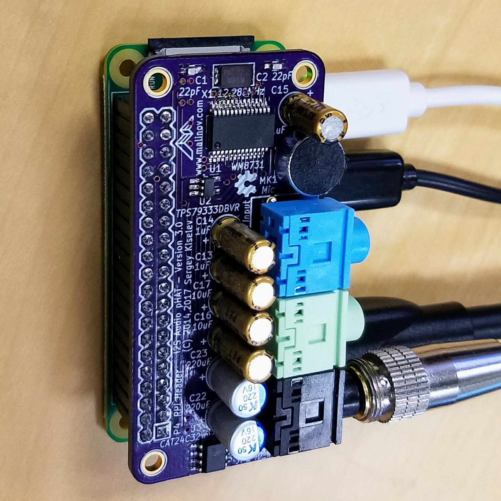

# I2S Audio pHAT
I2S Audio Interface for Raspberry Pi Zero

## Introduction
This is a Raspberry Pi Zero pHAT form-factor I2S audio interface board based on a Cirrus Logic (Wolfson) WM8731 audio codec. It provides line input, line output, headphones output, and includes an on-board microphone.

## Hardware Documentation

### Schematic and PCB Layout

[Schematic - Version 3.0](documentation/I2S_Audio_pHAT-Schematic-3.0.pdf)

[PCB Layout - Version 3.0](documentation/I2S_Audio_pHAT-Board-3.0.pdf)

### Bill of Materials

Component type     | Reference | Description                       | Quantity | Possible sources and notes 
------------------ | --------- | --------------------------------- | -------- | --------------------------
PCB                |           | I2S Audio pHAT PCB - Version 3.0  | 1        | Order from [OSH Park](https://oshpark.com/shared_projects/yxrgLBxI)
Integrated Circuit | U1        | WM8731, I2S audio codec, SSOP28   | 1        | Mouser [238-WM8731SEDS/V](https://www.mouser.com/Search/ProductDetail.aspx?R=WM8731SEDS%2fVvirtualkey23800000virtualkey238-WM8731SEDS%2fV)
Integrated Circuit | U2        | TPS79333DBVR, LDO, SOT23-5        | 1        | Mouser [595-TPS79333DBVR](https://www.mouser.com/Search/ProductDetail.aspx?R=TPS79333DBVRvirtualkey59500000virtualkey595-TPS79333DBVR)
Integrated Circuit | U3        | CAT24C32WI-GT3, I2C EEPROM, SOIC8 | 1        | Mouser [698-CAT24C32WI-GT3](https://www.mouser.com/Search/ProductDetail.aspx?R=CAT24C32WI-GT3virtualkey69800000virtualkey698-CAT24C32WI-GT3)
Crystal            | X1        | 12.288MHz, 3 mm x 5.3 mm          | 1        | Mouser [717-7A-12.288MAAJ-T](https://www.mouser.com/Search/ProductDetail.aspx?R=7A-12.288MAAJ-Tvirtualkey57230000virtualkey717-7A-12.288MAAJ-T)
Microphone         | MK1       | 9.7 mm, electret condenser microphone | 1        | Mouser [490-CMA-4544PF-W](https://www.mouser.com/Search/ProductDetail.aspx?R=CMA-4544PF-Wvirtualkey51780000virtualkey490-CMA-4544PF-W)
Connector          | P1        | 3.5 mm audio jack, blue           | 1        | Mouser [806-STX-31205B284C](https://www.mouser.com/Search/ProductDetail.aspx?R=STX-3120-5B-284Cvirtualkey51700000virtualkey806-STX-31205B284C)
Connector          | P2        | 3.5 mm audio jack, green          | 1        | Mouser [806-STX-31205B577C](https://www.mouser.com/Search/ProductDetail.aspx?R=STX-3120-5B-577Cvirtualkey51700000virtualkey806-STX-31205B577C)
Connector          | P3        | 3.5 mm audio jack, black          | 1        | Mouser [806-STX-3120-5B](https://www.mouser.com/Search/ProductDetail.aspx?R=STX-3120-5Bvirtualkey51700000virtualkey806-STX-3120-5B)
Connector          | P4        | 20x2, 2.54 mm, socket             | 1        | Mouser [517-929852-01-20-RB](https://www.mouser.com/Search/ProductDetail.aspx?R=929852-01-20-RBvirtualkey51750000virtualkey517-929852-01-20-RB)
Header             | JP1       | 2x1, 2.54mm, header               | 1        | (optional) Mouser [855-M20-9990245](https://www.mouser.com/Search/ProductDetail.aspx?R=M20-9990245virtualkey57420000virtualkey855-M20-9990245)
Capacitor          | C1, C2    | 22pF, 0603                        | 2        | Mouser [77-VJ0603A220JXACBC](https://www.mouser.com/Search/ProductDetail.aspx?R=VJ0603A220JXACW1BCvirtualkey61340000virtualkey77-VJ0603A220JXACBC)
Capacitor          | C3-C5     | 220pF, 0603                       | 3        | Mouser [77-VJ0603A221GXAPBC](https://www.mouser.com/Search/ProductDetail.aspx?R=VJ0603A221GXAPW1BCvirtualkey61340000virtualkey77-VJ0603A221GXAPBC)
Capacitor          | C6        | 0.01uF, 0603                      | 1        | Mouser [77-VJ0603Y103KXACBC](https://www.mouser.com/Search/ProductDetail.aspx?R=VJ0603Y103KXACW1BCvirtualkey61340000virtualkey77-VJ0603Y103KXACBC)
Capacitor          | C7-C12    | 0.1uF, 0603                       | 6        | Mouser [77-VJ0603Y104JXJPBC](https://www.mouser.com/Search/ProductDetail.aspx?R=VJ0603Y104JXJPW1BCvirtualkey61340000virtualkey77-VJ0603Y104JXJPBC)
Capacitor          | C13-C15   | 1uF, 5 mm, radial                 | 3        | Mouser [647-UFG1H010MDM](https://www.mouser.com/Search/ProductDetail.aspx?R=UFG1H010MDMvirtualkey64700000virtualkey647-UFG1H010MDM)
Capacitor          | C16, C17  | 10uF, 5 mm, radial                | 2        | Mouser [647-UFW1J100MDD](https://www.mouser.com/Search/ProductDetail.aspx?R=UFW1J100MDDvirtualkey64700000virtualkey647-UFW1J100MDD)
Capacitor          | C18-C21   | 10uF, 0603                        | 4        | Mouser [81-GRM188R61A106KE9D](https://www.mouser.com/Search/ProductDetail.aspx?R=GRM188R61A106KE69Dvirtualkey64800000virtualkey81-GRM188R61A106KE9D)
Capacitor          | C22, C23  | 220uF, 6.3 mm, radial             | 2        | Mouser [647-UFW1C221MED](https://www.mouser.com/Search/ProductDetail.aspx?R=UFW1C221MEDvirtualkey64700000virtualkey647-UFW1C221MED)
Resistor           | R1-R6     | 33 ohm, 0603                      | 6        | Mouser [603-RC0603FR-0733RL](https://www.mouser.com/Search/ProductDetail.aspx?R=RC0603FR-0733RLvirtualkey57620000virtualkey603-RC0603FR-0733RL)
Resistor           | R7, R8    | 100 ohm, 0603                     | 2        | Mouser [603-RC0603FR-07100RL](https://www.mouser.com/Search/ProductDetail.aspx?R=RC0603FR-07100RLvirtualkey57620000virtualkey603-RC0603FR-07100RL)
Resistor           | R9        | 330 ohm, 0603                     | 1        | Mouser [603-RC0603FR-07330RL](https://www.mouser.com/Search/ProductDetail.aspx?R=RC0603FR-07330RLvirtualkey57620000virtualkey603-RC0603FR-07330RL)
Resistor           | R10       | 680 ohm, 0603                     | 1        | Mouser [603-RC0603FR-07680RL](https://www.mouser.com/Search/ProductDetail.aspx?R=RC0603FR-07680RLvirtualkey57620000virtualkey603-RC0603FR-07680RL)
Resistor           | R11       | 1 kohm, 0603                      | 1        | Mouser [603-RC0603FR-071KL](https://www.mouser.com/Search/ProductDetail.aspx?R=RC0603FR-071KLvirtualkey57620000virtualkey603-RC0603FR-071KL)
Resistor           | R12, R13  | 3.9 kohm, 0603                    | 2        | Mouser [603-RC0603FR-073K9L](https://www.mouser.com/Search/ProductDetail.aspx?R=RC0603FR-073K9Lvirtualkey57620000virtualkey603-RC0603FR-073K9L)
Resistor           | R14-R18   | 5.6 kohm, 0603                    | 5        | Mouser [603-RC0603FR-075K6L](https://www.mouser.com/Search/ProductDetail.aspx?R=RC0603FR-075K6Lvirtualkey57620000virtualkey603-RC0603FR-075K6L)
Resistor           | R19-R22   | 47 kohm, 0603                     | 4        | Mouser [603-RC0603FR-0747KL](https://www.mouser.com/Search/ProductDetail.aspx?R=RC0603FR-0747KLvirtualkey57620000virtualkey603-RC0603FR-0747KL)

## Software Configuration

### Raspbian

Open `/boot/config.txt` in your favorite editor (nano, vi) as root, for example:

    sudo nano /boot/config.txt

Comment out the `dtparam=audio=on` line:

    # Enable audio (loads snd_bcm2835)
    #dtparam=audio=on

Add the following lines:

    # Enable WM8731 codec
    dtparam=i2c_arm=on
    dtparam=i2s=on
    dtoverlay=i2s-mmap
    dtoverlay=rpi-proto

Save the file and reboot the system.

Start `alsamixer`. If the I2S Audio pHAT is detected properly, it should show "Card: snd_rpi_proto" on the top left. Also use this opportunity to unmute "Output Mixer HiFi" control, otherwise the codec will not play any sound. To do so, use cursor keys to highlight that control, and then push "M" key to unmute it.

Now you can use your favorite application to play music. Enjoy!

